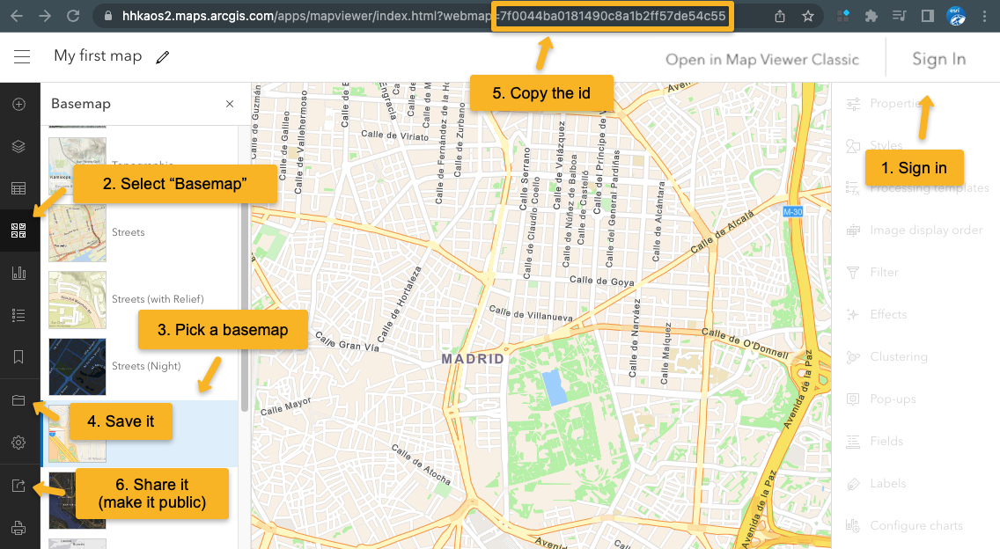

# Map your holiday - EuroCarto 2022 Workshop

## Workshop Prerequisites

- Node.js 16.0+ - [Installation](https://nodejs.org/en/)
- [VSCode](https://code.visualstudio.com/)
- git - [Installation](https://git-scm.com/book/en/v2/Getting-Started-Installing-Git)

## Set up project locally

In the command line (tip - I use [Hyper](https://hyper.is/) and I love it):

Clone the project:

```
git clone git@github.com:RalucaNicola/tutorial-holiday-map.git
```

Go to the newly created folder and install dependency libraries:

```
cd tutorial-holiday-map
npm install
```

To start a local server with the project:

```
npm run dev
```

Then open your browser at http://localhost:3000/

## Set up the map

To create the map you'll need a free [ArcGIS Developer account](https://developers.arcgis.com/sign-up). Once you created it and confirmed your email address, you can use it to create a web map:

1. Go to the [ArcGIS Map Viewer](https://www.arcgis.com/apps/mapviewer/index.html) and login with the account you created.
2. Activate the "Basemap" selection tool.
3. Choose a basemap.
4. Save the web map.
5. Copy the ID.
6. Share it (Choose: "Everyone (public)").
7. Load it in the application using your ID.



Note: If you'd like to create a custom vector tile basemap, you can do it with the [Vector Tile Style Editor](https://developers.arcgis.com/vector-tile-style-editor/)

## Create the data

I used [geojson.io](https://geojson.io/) to create the [point and line data](./public/data/) for this project.

## Add content

Add images, videos and text as part of [index.html](./index.html) file.

Each section can be connected with an action on the map like filtering features, zooming to a certain extent etc.

Once you are happy with your map you can create a production build and deploy it to [GitHub Pages](https://pages.github.com/).

## Create production build

```
npm run build
```

The `dist` folder then contains all the files for the web app which can either be copied to a web server or pushed to the `gh-pages` branch to be served at `https://arnofiva.github.io/arcgis-core-template`.

In order to use the `gh-pages` approach, see the following instructions. Make sure you remove an existing `dist` folder if it has been created from a previous build.

## Deploy to [GitHub Pages](https://pages.github.com/)

### Create `gh-pages` branch

You can skip this part if you used the template by copying all branches, which includs the `gh-pages` branch that is part of this project.

If you only copied the `main` branch, follow these steps to create an orphan `gh-pages` branch (meaning it does not share any history with `main`):

```
rm -rf dist
git checkout --orphan gh-pages
git rm -rf .
git commit --allow-empty -m "Init empty branch"
git push origin gh-pages
```

Return to `main` branch:

```
git checkout main
```

### Checkout `gh-pages` branch in `dist/` folder

The following will create a `dist` folder (fails if it already exists) and make it point to the root of the `gh-pages` branch:

```
git worktree add dist gh-pages
```

### Deploy new version on `gh-pages` branch

Once the previous steps have been completed, you can repeat the following every time you want to deploy a new version of your local code:

```
npm run build
cd dist/
git add .
git commit -am '🎉'
git push origin gh-pages
cd ../
```
